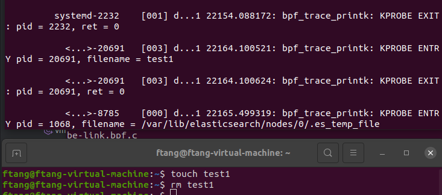

int BPF_KPROBE(do_unlinkat, int dfd, struct filename *name)是一个BPF程序的入口点，它定义了一个名为do_unlinkat的BPF探针函数。该函数将被插入到内核中的do_unlinkat系统调用中，并在系统调用执行之前被调用。

dfd 表示打开文件的描述符，是在调用 do_unlinkat 系统调用时传入的参数。do_unlinkat 是一个系统调用，用于删除指定的文件。它的函数原型如下：
`int do_unlinkat(int dfd, const char __user *pathname, int flag)
`
其中，dfd 表示打开文件的描述符，pathname 表示要删除的文件路径，flag 表示标志位。在本段代码中，我们只关注 dfd 和 name 两个参数，因为这两个参数在探针函数中被使用了。

在 BPF 控制程序中，我们可以使用 BPF 指令注入到内核中，从而截获系统调用，并在系统调用执行之前或之后执行我们的代码。通过这种方式，我们可以监视和修改系统调用的行为。在本例中，我们使用 BPF_KPROBE 注入到内核中，在 do_unlinkat 系统调用执行之前获取进程ID和要删除的文件名，并将它们打印出来。

due to above desc, we can write another  linkat sample:

int linkat(int efd, const char *exitingpath, const char * newpath, int flag);
int unlinkat(int fd, const char *pathname, int flag);

int BPF_KPROBE(do_unlinkat, int dfd, struct filename *name) 这里的  struct filename *name 为什么不用 int do_unlinkat(int dfd, const char __user *pathname, int flag) 原型中的const char __user *pathname写法

当使用 eBPF 技术编写内核探针时，需要使用特定的数据结构和函数原型。在这种情况下，struct filename 是一种特定的数据结构，用于在内核中表示文件名。而 const char __user *pathname 则是标准 C 中表示用户空间文件路径名的方式。

为了在内核空间中更方便地访问和操作文件名，Linux 内核提供了 struct filename 结构体。该结构体包含了文件名字符串的指针和长度等信息，以及其他与文件名相关的属性。通过使用 struct filename，内核可以直接操作文件名数据结构，而无需进行内存拷贝等操作。

而在用户空间的应用程序中，通常会使用 C 标准库提供的函数和数据类型来处理文件路径名。其中，const char __user *pathname 是一种常见的表示用户空间文件路径名的方式。它是一个指向字符常量的指针，指向用户空间中的字符串。应用程序可以使用标准 C 库函数对该字符串进行操作。

所以，在 eBPF 程序中使用 struct filename *name 而不使用 const char __user *pathname 的原因是，eBPF 程序运行在内核空间，可以直接访问内核数据结构，而无需涉及用户空间和内核空间之间的数据传输。这样可以提高性能和安全性，并且更方便地操作文件名相关的数据结构。