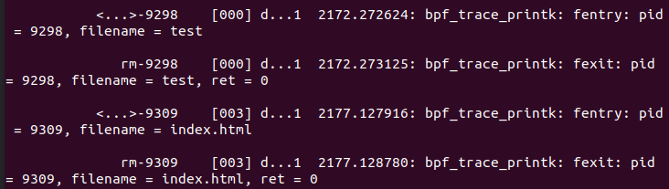

## Fentry
fentry（function entry）和 fexit（function exit）是 eBPF（扩展的伯克利包过滤器）中的两种探针类型，用于在 Linux 内核函数的入口和退出处进行跟踪。它们允许开发者在内核函数执行的特定阶段收集信息、修改参数或观察返回值。这种跟踪和监控功能在性能分析、故障排查和安全分析等场景中非常有用。

与 kprobes 相比，fentry 和 fexit 程序有更高的性能和可用性。在这个例子中，我们可以直接访问函数的指针参数，就像在普通的 C 代码中一样，而不需要使用各种读取帮助程序。fexit 和 kretprobe 程序最大的区别在于，fexit 程序可以访问函数的输入参数和返回值，而 kretprobe 只能访问返回值。从 5.5 内核开始，fentry 和 fexit 对 eBPF 程序可用。

